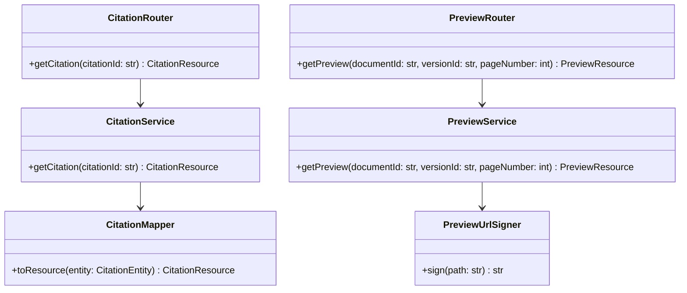

# Class Diagram Specification

## 1. PURPOSE

Mo ta cau truc lop cua Citation Preview module.

## 2. CLASS DIAGRAM

## 3. CLASS RESPONSIBILITY TABLE

| Class / Component | Responsibility | Key Operations | Dependencies | Notes |
| --- | --- | --- | --- | --- |
| CitationService | Resolve citation detail | `getCitation` | repository | read-only |
| PreviewService | Resolve preview resource | `getPreview` | signer, manifest repo | signed URLs |
| PreviewUrlSigner | Tao signed preview URL | `sign` | object storage config | security-sensitive |

## 4. DESIGN CONSIDERATIONS

- **Encapsulation & Cohesion:** Signing logic khong nam trong router.
- **Extensibility:** Co the them provider cho PDF/Word/Excel sau.
- **Reusability:** `PreviewResource` duoc query/search/frontend dung chung.
- **Compliance & Security:** Signed URLs ngan han.

## 5. CHANGE HISTORY

| Version | Date | Description | Author | Reviewer |
| --- | --- | --- | --- | --- |
| 1.0 | 2026-04-12 | Initial release | OpenAI Codex | Pending |
