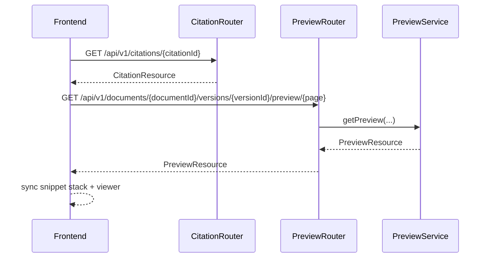

# Sequence Diagram Specification

## 1. PURPOSE

Capture citation click -> preview load flow.

## 2. SCENARIO DESCRIPTION

- **Trigger:** User click citation chip hoac search result trong UI.
- **Preconditions:** Citation id/document version ton tai va user co quyen.
- **Postconditions:** Viewer panel hien dung file/page/anchor hoac fallback state.
- **Business Outcome:** Analyst verify duoc evidence ma khong roi khoi workspace.

## 3. SEQUENCE DIAGRAM

## 4. ALTERNATE & EXCEPTION FLOWS

| Flow ID | Description | Trigger | Handling Strategy | Related Requirements |
| --- | --- | --- | --- | --- |
| ALT-1 | Preview URL already present in citation | eager payload | frontend co the load viewer truc tiep, endpoint dung de refresh signed URL khi can | BR-FN-007 |
| ERR-1 | Preview not ready | artifact absent | 409 + fallback snippet-only state | BR-FN-002 |
| ERR-2 | Citation not found | stale id | 404 + toast/error state | BR-FN-007 |

## 5. TIMING & PERFORMANCE NOTES

- **Expected Duration:** preview hydrate < 500ms.
- **Concurrency Considerations:** multiple rapid clicks; latest selection wins in frontend.
- **Timeout / Retry Strategy:** frontend co the manual retry preview resolver.

## 6. OBSERVABILITY HOOKS

- **Logs:** `citation_click_resolved`, `preview_panel_loaded`.
- **Metrics:** preview_latency_ms, preview_retry_count.
- **Tracing:** `citation.resolve`, `preview.resolve`.

## 7. CHANGE HISTORY

| Version | Date | Description | Author | Reviewer |
| --- | --- | --- | --- | --- |
| 1.0 | 2026-04-12 | Initial release | OpenAI Codex | Pending |
