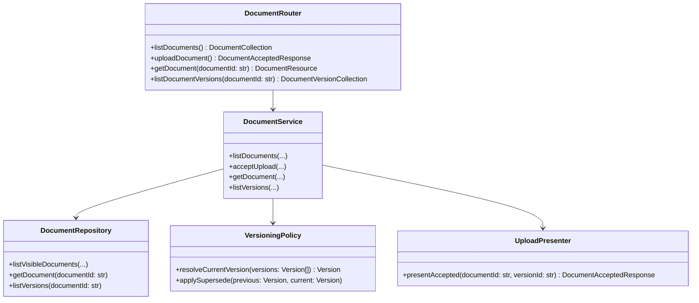

# Class Diagram Specification

## 1. PURPOSE

Mo ta cau truc lop cua Document Ingestion and Versioning module.

## 2. CLASS DIAGRAM

## 3. CLASS RESPONSIBILITY TABLE

| Class / Component | Responsibility | Key Operations | Dependencies | Notes |
| --- | --- | --- | --- | --- |
| DocumentService | Nghiep vu document/version | `acceptUpload`, `listVersions` | repository, policy | Core |
| VersioningPolicy | Ap rule current/superseded version | `resolveCurrentVersion` | None | Mandatory contract |
| DocumentRepository | Doc metadata stores | CRUD-like reads | DB/object storage | Stub in MVP |

## 4. DESIGN CONSIDERATIONS

- **Encapsulation & Cohesion:** Versioning policy tach khoi router.
- **Extensibility:** Co the them connector ingestion sau nay ma khong doi API.
- **Reusability:** DocumentRepository duoc Citation module dung lai.
- **Compliance & Security:** Signed preview/download URL phai o tang service/repository.

## 5. CHANGE HISTORY

| Version | Date | Description | Author | Reviewer |
| --- | --- | --- | --- | --- |
| 1.0 | 2026-04-12 | Initial release | OpenAI Codex | Pending |
