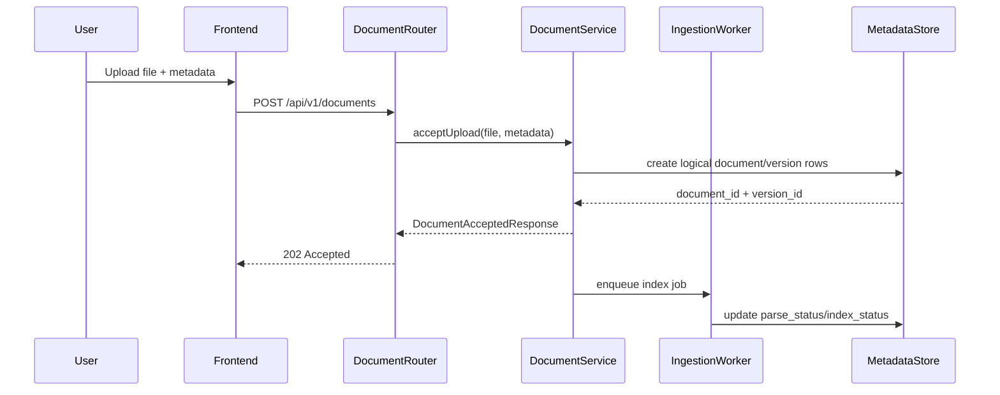

# Sequence Diagram Specification

## 1. PURPOSE

Capture upload and version promotion flow.

## 2. SCENARIO DESCRIPTION

- **Trigger:** User upload file moi tu left repository panel.
- **Preconditions:** User co quyen upload, metadata co the xac dinh document type.
- **Postconditions:** API tra accepted response, ingestion worker se cap nhat version status sau.
- **Business Outcome:** Tai lieu moi vao kho ma khong block UI query flow.

## 3. SEQUENCE DIAGRAM

## 4. ALTERNATE & EXCEPTION FLOWS

| Flow ID | Description | Trigger | Handling Strategy | Related Requirements |
| --- | --- | --- | --- | --- |
| ALT-1 | Existing logical document | metadata resolves same doc | create new version only | BR-FN-001 |
| ERR-1 | Upload validation fail | unsupported file or bad metadata | 422 | BR-FN-002 |
| ERR-2 | Indexing fail later | parser/OCR fail | version `failed`, previous current retained | BR-NF-003 |

## 5. TIMING & PERFORMANCE NOTES

- **Expected Duration:** upload accept path < 500ms; indexing async.
- **Concurrency Considerations:** Multiple uploads cho cung document can rely on version ids, khong overwrite.
- **Timeout / Retry Strategy:** Upload request khong doi indexing completion.

## 6. OBSERVABILITY HOOKS

- **Logs:** `upload_received`, `version_created`, `index_job_enqueued`.
- **Metrics:** `upload_accept_latency_ms`, `indexing_status_count`.
- **Tracing:** `document.upload.accept`, `document.index.enqueue`.

## 7. CHANGE HISTORY

| Version | Date | Description | Author | Reviewer |
| --- | --- | --- | --- | --- |
| 1.0 | 2026-04-12 | Initial release | OpenAI Codex | Pending |
