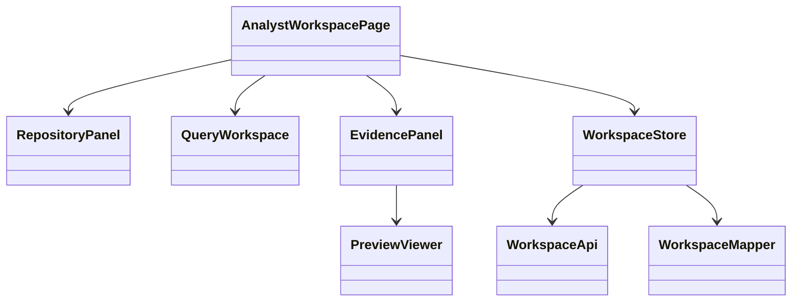

# Class Diagram Specification

## 1. PURPOSE

Mo ta cau truc thanh phan cua Analyst Workspace frontend.

## 2. CLASS DIAGRAM

## 3. CLASS RESPONSIBILITY TABLE

| Class / Component | Responsibility | Key Operations | Dependencies | Notes |
| --- | --- | --- | --- | --- |
| AnalystWorkspacePage | Shell 3-column layout | render, hydrate | store | page root |
| RepositoryPanel | file tree + upload | `onUpload`, `onSelectDocument` | store | left panel |
| QueryWorkspace | query thread + composer | `onSubmit`, `onVoiceDraft` | store | center |
| EvidencePanel | snippet stack + sync | `onSelectCitation` | store | right |
| PreviewViewer | render preview or fallback | `loadPreview` | store | right lower |
| WorkspaceStore | shared UI state | reducer actions | api, mapper | single source |

## 4. DESIGN CONSIDERATIONS

- **Encapsulation & Cohesion:** API calls nam trong `WorkspaceApi`, khong nam trong presentational components.
- **Extensibility:** de them compare mode sau ma khong vo 3-column shell.
- **Reusability:** mapper layer tach wire model va view model.
- **Compliance & Security:** preview render chi dung trusted URL.

## 5. CHANGE HISTORY

| Version | Date | Description | Author | Reviewer |
| --- | --- | --- | --- | --- |
| 1.0 | 2026-04-12 | Initial release | OpenAI Codex | Pending |
