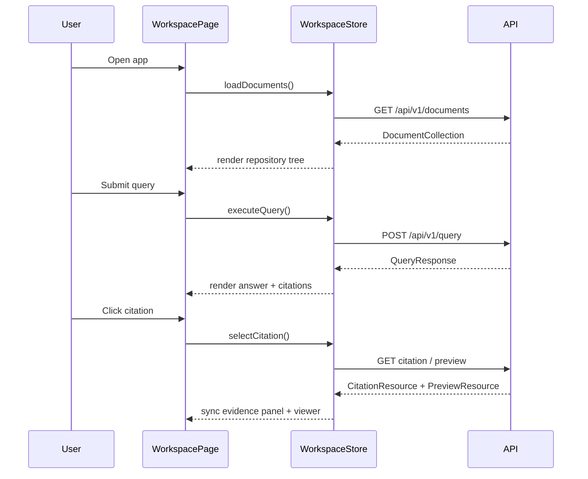

# Sequence Diagram Specification

## 1. PURPOSE

Capture primary frontend interaction loop cho analyst workspace.

## 2. SCENARIO DESCRIPTION

- **Trigger:** User vao trang workspace va dat query dau tien.
- **Preconditions:** API san sang, frontend co base URL.
- **Postconditions:** Documents tree duoc load, answer va preview dong bo.
- **Business Outcome:** User co the upload, hoi, va verify tren cung mot man hinh.

## 3. SEQUENCE DIAGRAM

## 4. ALTERNATE & EXCEPTION FLOWS

| Flow ID | Description | Trigger | Handling Strategy | Related Requirements |
| --- | --- | --- | --- | --- |
| ALT-1 | Upload during active session | user uploads file | tree refresh + indexing badge | BR-FN-001 |
| ERR-1 | Query fails | API 500/504 | inline error card + retry | BR-NF-004 |
| ERR-2 | Preview not ready | API 409 | fallback file card | BR-FN-007 |

## 5. TIMING & PERFORMANCE NOTES

- **Expected Duration:** workspace load < 2s fixture mode; query pending state hien ngay lap tuc.
- **Concurrency Considerations:** latest citation selection wins; in-flight preview request cu co the bi bo qua.
- **Timeout / Retry Strategy:** user-triggered retry.

## 6. OBSERVABILITY HOOKS

- **Logs:** client fetch error boundary only.
- **Metrics:** not required in MVP.
- **Tracing:** not required in MVP.

## 7. CHANGE HISTORY

| Version | Date | Description | Author | Reviewer |
| --- | --- | --- | --- | --- |
| 1.0 | 2026-04-12 | Initial release | OpenAI Codex | Pending |
