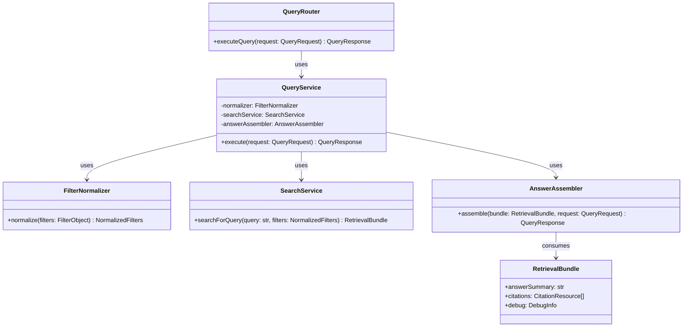

# Class Diagram Specification

## 1. PURPOSE

Mo ta cau truc lop cho Query Orchestration module trong MVP.

## 2. CLASS DIAGRAM

## 3. CLASS RESPONSIBILITY TABLE

| Class / Component | Responsibility | Key Operations | Dependencies | Notes |
| --- | --- | --- | --- | --- |
| QueryRouter | FastAPI transport boundary | `executeQuery` | QueryService | Chi xu ly HTTP concern |
| QueryService | Dieu phoi use case query | `execute` | FilterNormalizer, SearchService, AnswerAssembler | Trung tam nghiep vu |
| FilterNormalizer | Canonicalize metadata filters | `normalize` | None | Tien de cho retrieval |
| AnswerAssembler | Dong bo answer card format va citations | `assemble` | RetrievalBundle | Giu evidence-first |

## 4. DESIGN CONSIDERATIONS

- **Encapsulation & Cohesion:** Query logic khong nam trong router.
- **Extensibility:** De thay SearchService stub bang LangGraph/orchestrator that sau nay.
- **Reusability:** FilterNormalizer co the duoc Search API dung lai.
- **Compliance & Security:** User scope duoc normalizer dua vao retrieval filter.

## 5. CHANGE HISTORY

| Version | Date | Description | Author | Reviewer |
| --- | --- | --- | --- | --- |
| 1.0 | 2026-04-12 | Initial release | OpenAI Codex | Pending |
