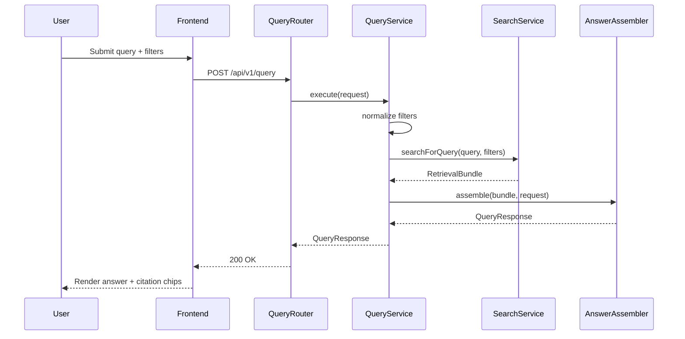

# Sequence Diagram Specification

## 1. PURPOSE

Capture end-to-end grounded query flow cho `POST /api/v1/query`.

## 2. SCENARIO DESCRIPTION

- **Trigger:** Analyst gui natural-language query tu workspace.
- **Preconditions:** User da dang nhap, metadata/index da san sang.
- **Postconditions:** UI nhan `QueryResponse` co answer va citations.
- **Business Outcome:** Analyst co the doc ket luan va kiem chung ngay tren evidence panel.

## 3. SEQUENCE DIAGRAM

## 4. ALTERNATE & EXCEPTION FLOWS

| Flow ID | Description | Trigger | Handling Strategy | Related Requirements |
| --- | --- | --- | --- | --- |
| ALT-1 | Insufficient evidence | RetrievalBundle rong hoac score thap | Return 200 voi `insufficient_evidence=true` | BR-NF-002 |
| ERR-1 | Validation error | Query khong hop le | Return 422 `ErrorEnvelope` | BR-FN-003 |
| ERR-2 | Upstream timeout | Search/model timeout | Return 504 `ErrorEnvelope` | BR-NF-001 |

## 5. TIMING & PERFORMANCE NOTES

- **Expected Duration:** p50 < 2.5s, p95 < 5s cho pilot query.
- **Concurrency Considerations:** Query stateless; khong lock shared state.
- **Timeout / Retry Strategy:** Single timeout boundary cho retrieval/synthesis; khong retry trong request path MVP.

## 6. OBSERVABILITY HOOKS

- **Logs:** `query_received`, `query_completed`, `query_failed`.
- **Metrics:** `query_latency_ms`, `query_error_count`, `query_insufficient_evidence_count`.
- **Tracing:** `query.execute`, `query.normalize`, `query.search`, `query.assemble`.

## 7. CHANGE HISTORY

| Version | Date | Description | Author | Reviewer |
| --- | --- | --- | --- | --- |
| 1.0 | 2026-04-12 | Initial release | OpenAI Codex | Pending |
