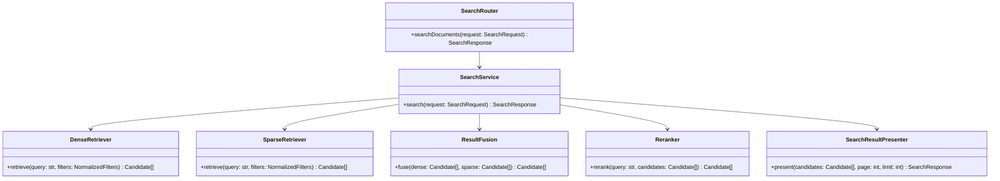

# Class Diagram Specification

## 1. PURPOSE

Mo ta cau truc lop cua Search and Retrieval module.

## 2. CLASS DIAGRAM

## 3. CLASS RESPONSIBILITY TABLE

| Class / Component | Responsibility | Key Operations | Dependencies | Notes |
| --- | --- | --- | --- | --- |
| SearchService | Dieu phoi retrieval/rerank/present | `search` | retrievers, fusion, rerank | Core module |
| DenseRetriever | Semantic retrieval | `retrieve` | vector store | Strategy 1 |
| SparseRetriever | Keyword retrieval | `retrieve` | sparse index | Strategy 2 |
| ResultFusion | Hop candidate | `fuse` | None | RRF/fusion contract |
| SearchResultPresenter | Map candidate sang OpenAPI union | `present` | None | API-facing |

## 4. DESIGN CONSIDERATIONS

- **Encapsulation & Cohesion:** Presenter khong tham gia retrieval logic.
- **Extensibility:** Co the doi retriever/reranker ma khong doi router.
- **Reusability:** SearchService duoc QueryService dung lai.
- **Compliance & Security:** Access filtering phai truoc presenter.

## 5. CHANGE HISTORY

| Version | Date | Description | Author | Reviewer |
| --- | --- | --- | --- | --- |
| 1.0 | 2026-04-12 | Initial release | OpenAI Codex | Pending |
