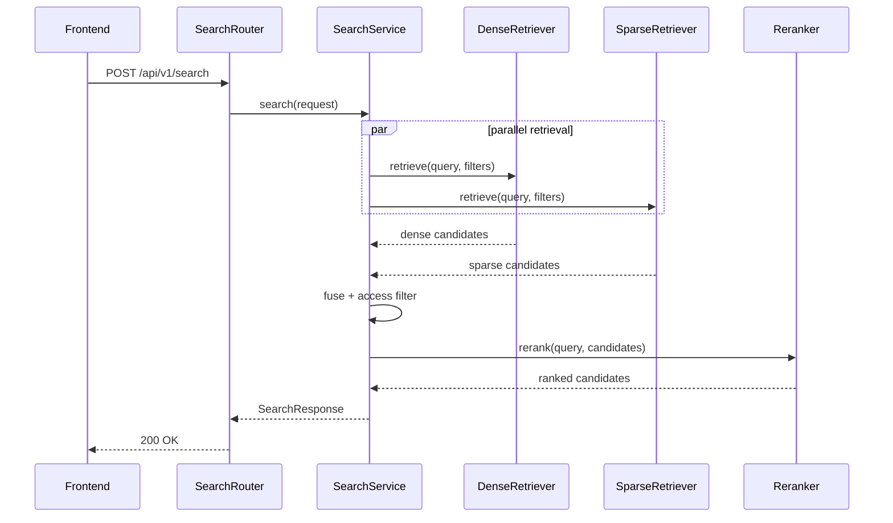

# Sequence Diagram Specification

## 1. PURPOSE

Capture search-only flow cho `POST /api/v1/search`.

## 2. SCENARIO DESCRIPTION

- **Trigger:** User muon xem tai lieu/chunk ma chua can answer synthesis.
- **Preconditions:** Search index va metadata registry san sang.
- **Postconditions:** Frontend nhan ranked result list co preview metadata.
- **Business Outcome:** Analyst mo duoc tai lieu nguon nhanh hon truoc khi query tong hop.

## 3. SEQUENCE DIAGRAM

## 4. ALTERNATE & EXCEPTION FLOWS

| Flow ID | Description | Trigger | Handling Strategy | Related Requirements |
| --- | --- | --- | --- | --- |
| ALT-1 | Dense empty, sparse non-empty | vector miss | Continue with sparse-only fusion | BR-FN-003 |
| ERR-1 | Rerank timeout | provider issue | fallback fused order + warning log | BR-NF-001 |
| ERR-2 | Validation error | page/limit invalid | 422 | BR-FN-003 |

## 5. TIMING & PERFORMANCE NOTES

- **Expected Duration:** p95 < 3.5s search-only.
- **Concurrency Considerations:** dense/sparse retrieval co the chay song song.
- **Timeout / Retry Strategy:** Khong retry rerank trong MVP.

## 6. OBSERVABILITY HOOKS

- **Logs:** `search_dense_done`, `search_sparse_done`, `search_rerank_done`.
- **Metrics:** `dense_candidates`, `sparse_candidates`, `search_latency_ms`.
- **Tracing:** `search.request`, `search.dense`, `search.sparse`, `search.rerank`.

## 7. CHANGE HISTORY

| Version | Date | Description | Author | Reviewer |
| --- | --- | --- | --- | --- |
| 1.0 | 2026-04-12 | Initial release | OpenAI Codex | Pending |
