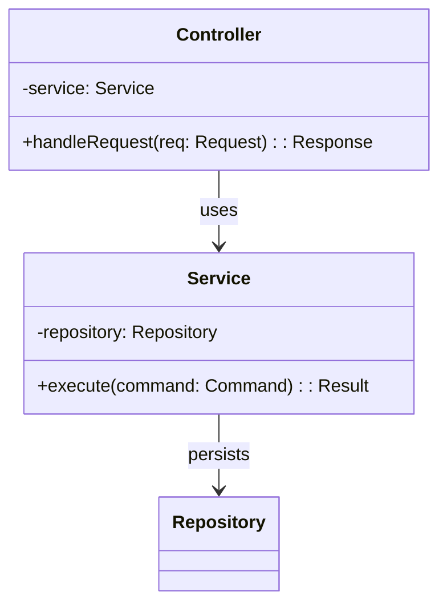

# Class Diagram Specification

**MERCURY SOLUTIONS**
**Software Engineering Excellence**

---

## DOCUMENT CONTROL

| Field                  | Value                                     |
| ---------------------- | ----------------------------------------- |
| **Document ID**        | LLD-DIAG-[PROJECT]-[MODULE]-[YYYY]-[NNN]  |
| **Template Version**   | 1.0                                       |
| **Document Version**   | [e.g., 1.0]                               |
| **Project / Product**  | [Enter Project Name]                      |
| **Module / Component** | [Enter Module Name]                       |
| **Author**             | [Name, Role]                              |
| **Reviewer(s)**        | [Tech Lead, Architect]                    |
| **Document Status**    | [Draft / In Review / Approved / Baseline] |
| **Classification**     | [Internal / Confidential]                 |
| **Creation Date**      | [YYYY-MM-DD]                              |
| **Last Updated**       | [YYYY-MM-DD]                              |
| **Approved By**        | [Name, Role]                              |
| **Approval Date**      | [YYYY-MM-DD]                              |
| **AI-Assisted**        | [ ] Yes - Tool: **\_\_\_** [ ] No         |

---

## ISO STANDARDS COMPLIANCE

**This template satisfies:**

- ✓ ISO/IEC 12207:2017 - Clause 6.4.5 (Design Definition)
- ✓ ISO/IEC 15288:2023 - Clause 6.4.5 (Design Definition Process)
- ✓ ISO/IEC/IEEE 42010:2022 - Architecture viewpoint representation

**Traceability to:**

- TEMPLATE-LLD-001-Module_Design.md
- TEMPLATE-LLD-004-Sequence_Diagram.md
- TEMPLATE-REQ-002-Software_Requirements_Specification.md

---

## 1. PURPOSE

Describe structural relationships between classes/components within `[Module Name]` to support implementation, testing, and maintenance.

---

## 2. DIAGRAM GUIDELINES

- Use **Mermaid** or **PlantUML** syntax (` ```mermaid ` / ` ```plantuml ` blocks).
- Include aggregations, compositions, inheritance, interfaces, and multiplicities.
- Annotate key methods/attributes with visibility and types.
- Highlight dependencies on shared libraries or external services.
- Ensure naming matches code packages/namespaces.

---

## 3. CLASS DIAGRAM



> Replace the example with the actual module design. Provide multiple diagrams if necessary (e.g., domain vs. infrastructure).

---

## 4. CLASS RESPONSIBILITY TABLE

| Class / Component | Responsibility | Key Operations | Dependencies | Notes |
| ----------------- | -------------- | -------------- | ------------ | ----- |
|                   |                |                |              |       |

---

## 5. DESIGN CONSIDERATIONS

- **Encapsulation & Cohesion:** `[Describe how responsibilities are grouped.]`
- **Extensibility:** `[Planned extension points, interfaces.]`
- **Reusability:** `[Shared components or libraries leveraged.]`
- **Compliance & Security:** `[Controls implemented at class level (input validation, auditing).]`

---

## 6. CHANGE HISTORY

| Version | Date         | Description     | Author | Reviewer |
| ------- | ------------ | --------------- | ------ | -------- |
| 1.0     | [YYYY-MM-DD] | Initial release | [Name] | [Name]   |
| 1.1     |              |                 |        |          |
