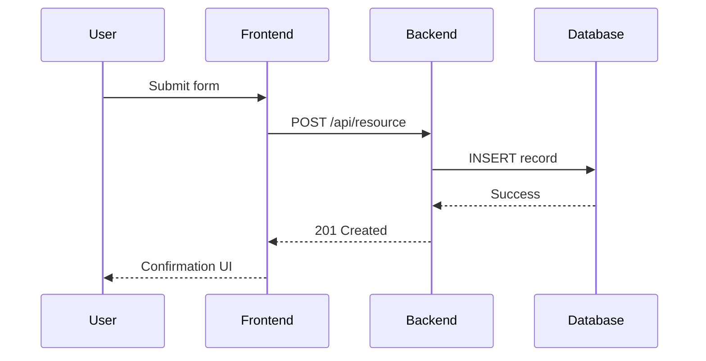

# Sequence Diagram Specification

**MERCURY SOLUTIONS**
**Software Engineering Excellence**

---

## DOCUMENT CONTROL

| Field                   | Value                                     |
| ----------------------- | ----------------------------------------- |
| **Document ID**         | LLD-SEQ-[PROJECT]-[SCENARIO]-[YYYY]-[NNN] |
| **Template Version**    | 1.0                                       |
| **Document Version**    | [e.g., 1.0]                               |
| **Project / Product**   | [Enter Project Name]                      |
| **Scenario / Use Case** | [Enter Scenario Name]                     |
| **Author**              | [Name, Role]                              |
| **Reviewer(s)**         | [Tech Lead, QA Lead]                      |
| **Document Status**     | [Draft / In Review / Approved / Baseline] |
| **Classification**      | [Internal / Confidential]                 |
| **Creation Date**       | [YYYY-MM-DD]                              |
| **Last Updated**        | [YYYY-MM-DD]                              |
| **Approved By**         | [Name, Role]                              |
| **Approval Date**       | [YYYY-MM-DD]                              |
| **AI-Assisted**         | [ ] Yes - Tool: **\_\_\_** [ ] No         |

---

## ISO STANDARDS COMPLIANCE

**This template satisfies:**

- ✓ ISO/IEC 12207:2017 - Clause 6.4.5 (Design Definition)
- ✓ ISO/IEC 15288:2023 - Clause 6.4.5 (Design Definition Process)
- ✓ ISO/IEC/IEEE 42010:2022 - Behavioural viewpoints

**Traceability to:**

- TEMPLATE-LLD-001-Module_Design.md
- TEMPLATE-LC-005-Deployment_Plan.md (operational touchpoints)
- TEMPLATE-LC-011-Test_Plan_VnV.md (scenario-based testing)

---

## 1. PURPOSE

Capture ordered interactions between actors, systems, and components for `[Scenario Name]`, ensuring clarity on request/response flow, concurrency, and failure handling.

---

## 2. SCENARIO DESCRIPTION

- **Trigger:** `[Event/user action/system schedule that initiates the flow.]`
- **Preconditions:** `[Required state, configuration, data.]`
- **Postconditions:** `[Expected system state after sequence completes.]`
- **Business Outcome:** `[Customer value or internal objective achieved.]`

---

## 3. SEQUENCE DIAGRAM

> Use Mermaid (`sequenceDiagram`) or PlantUML syntax. Include notes for asynchronous flows, retries, compensating transactions, and error branches.

---

## 4. ALTERNATE & EXCEPTION FLOWS

| Flow ID | Description | Trigger | Handling Strategy | Related Requirements |
| ------- | ----------- | ------- | ----------------- | -------------------- |
| ALT-1   |             |         |                   | REQ-                 |
| ERR-1   |             |         |                   | REQ-                 |

---

## 5. TIMING & PERFORMANCE NOTES

- **Expected Duration:** `[Avg/95th percentile timings for key steps.]`
- **Concurrency Considerations:** `[How parallel requests are handled, locking, idempotency.]`
- **Timeout / Retry Strategy:** `[Backoff policies, circuit breakers.]`

---

## 6. OBSERVABILITY HOOKS

- **Logs:** `[Events to emit at each step for traceability.]`
- **Metrics:** `[Counters/timers capturing success/failure.]`
- **Tracing:** `[Span names, attributes linking to this sequence.]`

---

## 7. CHANGE HISTORY

| Version | Date         | Description     | Author | Reviewer |
| ------- | ------------ | --------------- | ------ | -------- |
| 1.0     | [YYYY-MM-DD] | Initial release | [Name] | [Name]   |
| 1.1     |              |                 |        |          |
